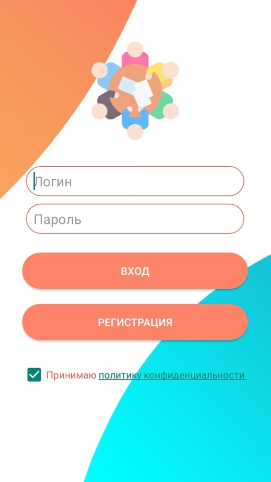
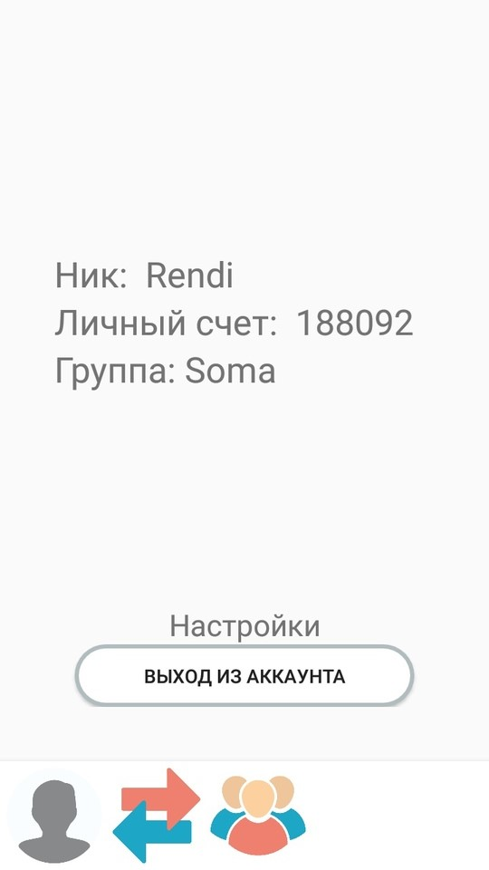
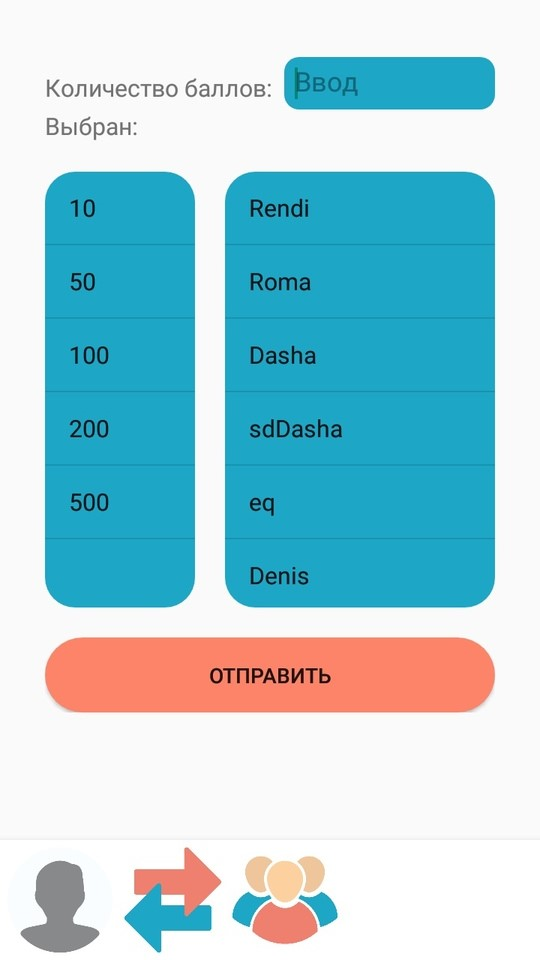
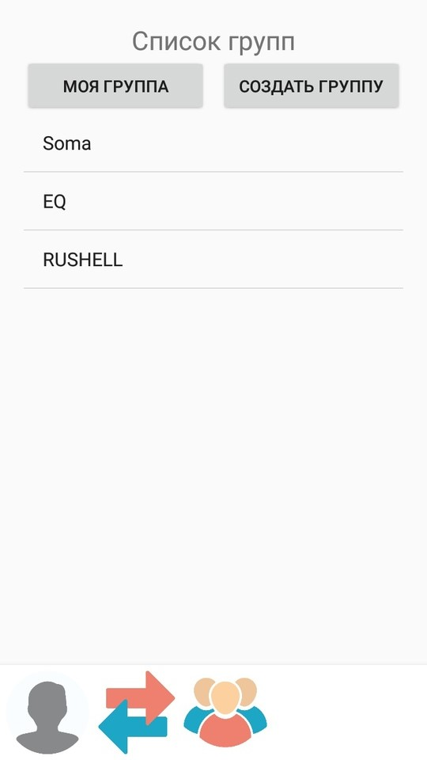
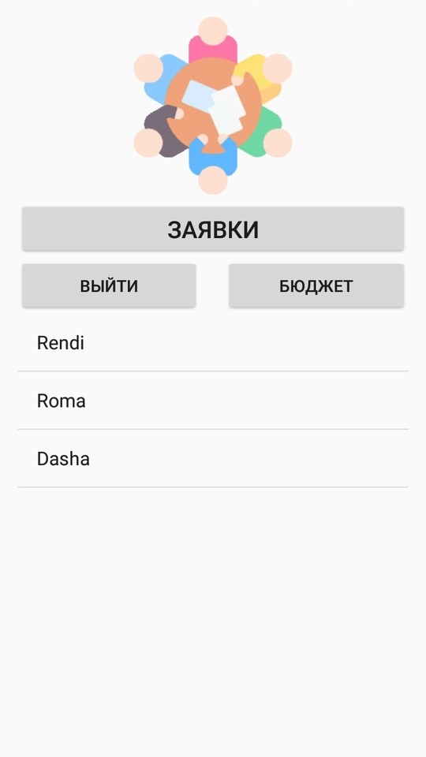
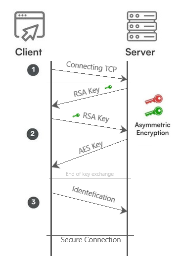

  

# CorPoints
CorPoints - это проект мобильного приложения. Данный проект является обучающей платформой для игры "Корпорация баллов". CorPoints подходит для мастер классов, бизнес-тренингов, обучающих маркетинговых уроков и т.д. 

Вся суть приложения строится вокруг специальных баллов, очков. Это некая валюта приложения. Очки можно отправлять другим пользователям, а также передавать их в бюджет группы. Группа - тоже одна из механик приложения. Можно создавать группы, вступать в них, а также у каждой группы есть свой бюджет, который определяет рейтинг группы.

# Сотрудничество
Для использования приложения, например в каком нибудь бизнес тренинге, необходимо написать мне на почту. Услуги являются бесплатными.

Как это проходит:
1. Клиент арендует время.
2. Я отправляю ему пароль и логин от аккаунта, на котором находится миллион баллов. 
3. После истечении времени я меняю пароль от аккаунта. 

То как пользоваться этими баллами вопрос воображения. 

# Mobile application 
Мобильное приложение написано на Android Studio. 

# Server
Сервер - один из компонентов проекта. Сервер проекта обычно работает на хосте corppoints.ru, и к нему иногда можно подключиться. 

Сервер с поддержкой безопасности в сети работает на протоколах шифрования RSA и AES. 

## Порядок установки соединения: 

# В будущем
В будущем планируется улучшить дизайн приложения, добавить некоторый рейтинг, новостную ленту. 